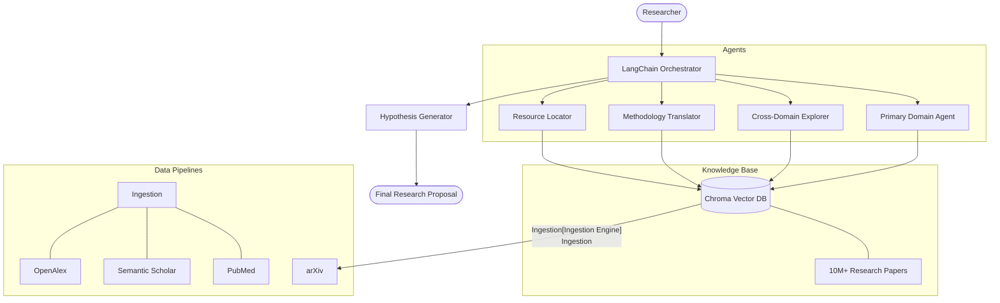

# Research Cross-Pollination Engine (RCPE) 🧬

[](https://github.com/PushkarPrabhath27/ResearchCrossPollinationEngine/actions/workflows/ci.yml)
[](https://opensource.org/licenses/Apache-2.0)
[](https://www.python.org/downloads/release/python-3100/)

**RCPE** is an AI-powered research platform designed to accelerate scientific discovery by automating the process of cross-disciplinary analogy detection. By analyzing millions of research papers across silos, RCPE identifies methodologies, datasets, and findings from one field that could solve critical problems in another.

## 🚀 The Vision: Breaking Scientific Silos

Over **4 million** scientific papers are published annually. Researchers are physically unable to keep up with the literature outside their immediate specialization. This "Information Overload" creates silos where breakthroughs in one field (e.g., fluid dynamics) remain hidden from researchers in another (e.g., oncology).

RCPE acts as a **Cross-Pollination Engine**, suggesting innovative hypotheses like:
> *"What if we applied the particle tracking algorithms from high-energy physics to track cancer cell migration in microfluidic assays?"*

## 🏗️ System Architecture



## 🛠️ Key Features

- **Agentic Multi-Step Reasoning**: Uses ReAct-style agents to decompose complex research questions.
- **Hybrid RAG Pipeline**: Combines dense vector retrieval with structured metadata filtering (year, citation count, field).
- **Automated Implementation Guides**: Generates step-by-step methodologies including suggested parameters and baseline datasets.
- **Resource Matching**: Automatically identifies relevant GitHub repositories and open-access datasets (CERN, materials project, etc.) for validation.

## 🏁 Quick Start

### 1. Installation
```bash
make setup
```

### 2. Configure API Keys
Add your keys to the generated `.env` file:
```env
OPENAI_API_KEY=sk-...
NCBI_EMAIL=...
```

### 3. Run a Research Query
```bash
python -m src.rcpe.main --query "How can graph theory solve protein folding challenges?"
```

## 📚 Scientific Grounding

RCPE's methodology is inspired by state-of-the-art research in NLP and Computational Pragmatics:
- **Retrieval-Augmented Generation (RAG)**: Lewis et al. (2020)
- **Scientific Document Embeddings**: Cohan et al. (2020) - SPECTER
- **Agentic Workflows**: Yao et al. (2022) - ReAct

Detailed methodology can be found in [docs/research_methodology.md](docs/research_methodology.md).

## 🤝 Contributing

We welcome contributions from researchers and engineers! Please see our [CONTRIBUTING.md](CONTRIBUTING.md) for guidelines on branch naming, code standards, and PR processes.

## 📄 License

RCPE is released under the [Apache 2.0 License](LICENSE).
